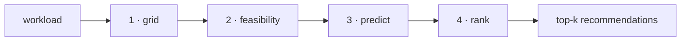

# How it works

Every entry point — Python, CLI, dashboard — runs the same four-stage pipeline.

1. **Grid** — generate candidate configurations: every combination of GPU count and batch size in
   the search space, with node layouts derived automatically.
2. **Feasibility** — drop candidates that can't run: layouts that don't divide evenly, and
   configurations the OOM classifier predicts would run out of memory.
3. **Predict** — for each survivor, predict throughput (tokens/sec) and power (watts). Runtime and
   energy follow from the workload size.
4. **Rank** — normalize the predictions and score each candidate on your goal — a weighted
   performance↔energy trade-off, or simply the fewest GPUs. Return the top-k.

## One engine, three doors

A single factory resolves your configuration — `strategy`, `predictors`, `grid` — into this
pipeline, whether it arrives as Python keyword arguments, a YAML file, or a dashboard form. That's
the whole architecture: same inputs, same recommendation, whatever the surface.

The pieces you can swap:

- **Predictors** — what estimates throughput, power, and feasibility.
  [Predictors](predictors.md)
- **Strategy** — how ranked candidates are scored. [Ranking strategies](strategies.md)

## Safeguards

Two config-level guarantees:

- `feasibility: autoconf` — never recommend a configuration predicted to OOM (the default).
- `max_slowdown: N` — never recommend a configuration more than N× slower than the fastest
  feasible one, no matter how energy-efficient.
