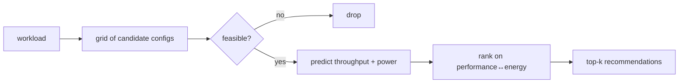

# Coastline

**A context-aware recommender for GPU and datacenter configurations for LLM fine-tuning.**

Give Coastline a workload — an LLM, a fine-tuning method, tokens per sample, a batch size — and it
tells you which configuration to run it on: how many GPUs, how many nodes, at what batch size, and
what throughput, runtime, and power to expect.

## Highlights

- 🔍 **Grid search with guardrails** — sweeps GPU counts and batch sizes, drops configs that would
  OOM before you ever run them.
- ⚡ **Throughput *and* power** — every candidate is scored on performance and energy, not just speed.
- 🎯 **One knob for intent** — `goal="performance" | "balanced" | "energy" | "min_gpu"`.
- 🐍 **Three surfaces, one engine** — Python API, `coastline` CLI, and a web dashboard.
- 📊 **Batch-friendly** — DataFrame in → DataFrame out, CSV in → CSV out, or annotate a whole
  fine-tuning trace.
- 🧠 **Pluggable predictors** — analytical physics (Kavier) by default, trained ML models
  (TabPFN, XGBoost, …) when you want them, your own tuned model via `coastline tune`.

## Quickstart

```bash
pip install coastline-recommender
```

```python
import coastline

advisor = coastline(predictor="kavier")
results = advisor.recommend(
    {"model": "mistral-7b-v0.1", "method": "lora",
     "gpu_model": "NVIDIA-A100-SXM4-80GB", "tokens_per_sample": 1024, "batch_size": 32},
    goal="balanced", max_gpus=8,
)
print(results[0])   # best-ranked Recommendation
```

## How it works



One pipeline, whatever the entry point. Read more in [How it works](concepts/how-it-works.md).

## Learn more

- [Installation](getting-started/installation.md) — pip / uv, and which extras you need
- [First recommendation](getting-started/first-recommendation.md) — Python and CLI in two minutes
- [Features](getting-started/features.md) — everything Coastline can do
- [CLI commands](reference/cli.md) — every command and flag

Coastline is developed at [AtLarge Research](https://atlarge-research.com) (VU Amsterdam) with IBM
Research, and validated on a 30,000-experiment fine-tuning trace.
