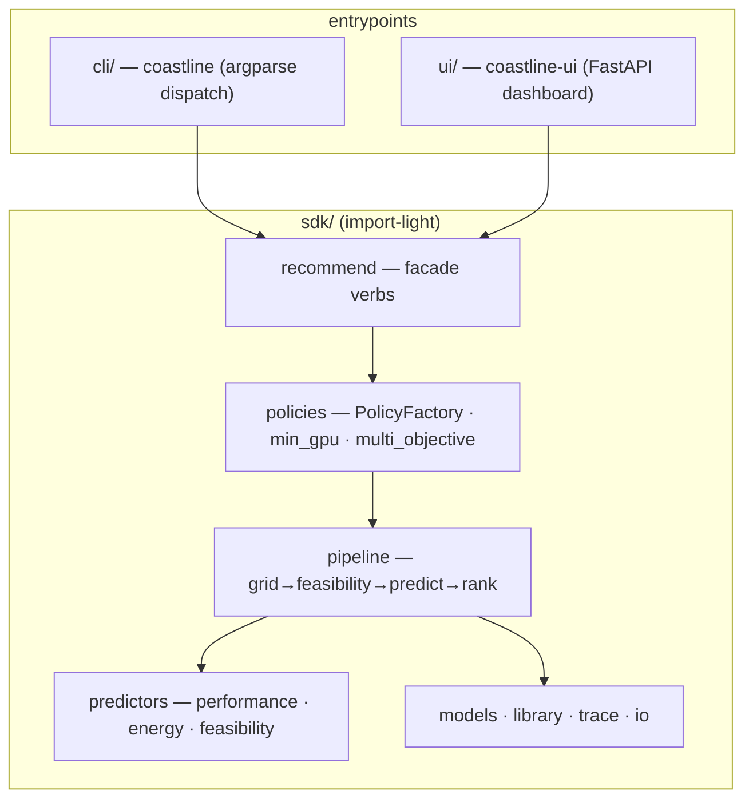
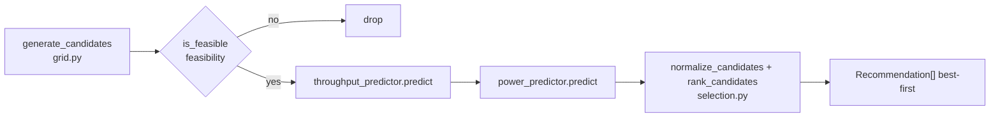
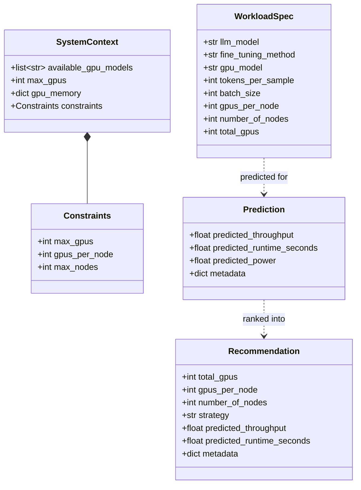

# Architecture

Coastline ships as **one package**, `coastline`, with three surfaces: a `cli/`, a `ui/`, and the
`sdk/` that holds all the logic. The CLI and UI only parse input and render output; they never
contain modelling code, and the SDK never imports back into them.

## The three surfaces {#surfaces}



`sdk/` is import-light by contract (PEP 562 lazy `__getattr__`): `import coastline` pulls no
pandas/torch/kavier until you actually call a verb, and heavy backends (torch, tabpfn, catboost,
xgboost, ado/AutoConf) load only when a named predictor is selected.

## Everything routes through PolicyFactory {#policyfactory}

`sdk/policies/__init__.py::PolicyFactory` is the **single source of truth** that resolves a config
into a strategy and a predictor. Whatever the entrypoint — Python facade, batch CSV, `coastline
run`, or the FastAPI UI — a config dict (`strategy` / `predictors` / `grid`) flows into
`PolicyFactory.create_strategy()`, which builds either a `min_gpu` or a `multi_objective` strategy.
Both wrap the **same** `GridWorkflowPipeline`. The pipeline delegates predictor construction back to
PolicyFactory (via a lazy import that breaks the cycle) so the two layers can never diverge.

## The data-flow pipeline {#pipeline}



Kavier returns power alongside throughput in one engine call — when the power predictor sets
`WRAPS_THROUGHPUT_ENGINE`, the pipeline reuses that result instead of a second call.

## Core domain objects {#domain}



These four pydantic models (in `sdk/models/`, formerly `coastline_common`) are the shared vocabulary
every predictor and policy speaks.

## Package structure {#structure}

```text
src/coastline/
├── cli/          coastline — recommend · run · recommend-trace · plot-trace · interactive
├── ui/           coastline-ui — FastAPI dashboard + REST
└── sdk/
    ├── recommend/    facade · batch DataFrame · CSV→CSV · engine
    ├── pipeline/     grid · feasibility · selection · workflow
    ├── predictors/   performance/{physics,retrieval,data_driven,composite} · energy · feasibility
    ├── policies/     PolicyFactory · min_gpu · multi_objective
    ├── models/       WorkloadSpec · SystemContext · Prediction · Recommendation
    ├── library/      GPU/LLM specs DB + physics constants
    ├── trace/        enrich · plot
    └── io/           config/options loaders · json/html artifacts · odc_runner
```

Dev-only tooling (`benchmark/`, the ML `trainer/` scripts, the `ado_plugin/`) lives under `dev/`
and is excluded from the wheel.

!!! note "Regenerating the diagrams"
    The class/package diagrams above are curated to match the code. To regenerate them straight
    from the source, use `pyreverse` (from pylint): `uv run --with pylint pyreverse -o mmd
    -p coastline src/coastline/sdk/models` emits Mermaid you can paste back here.
