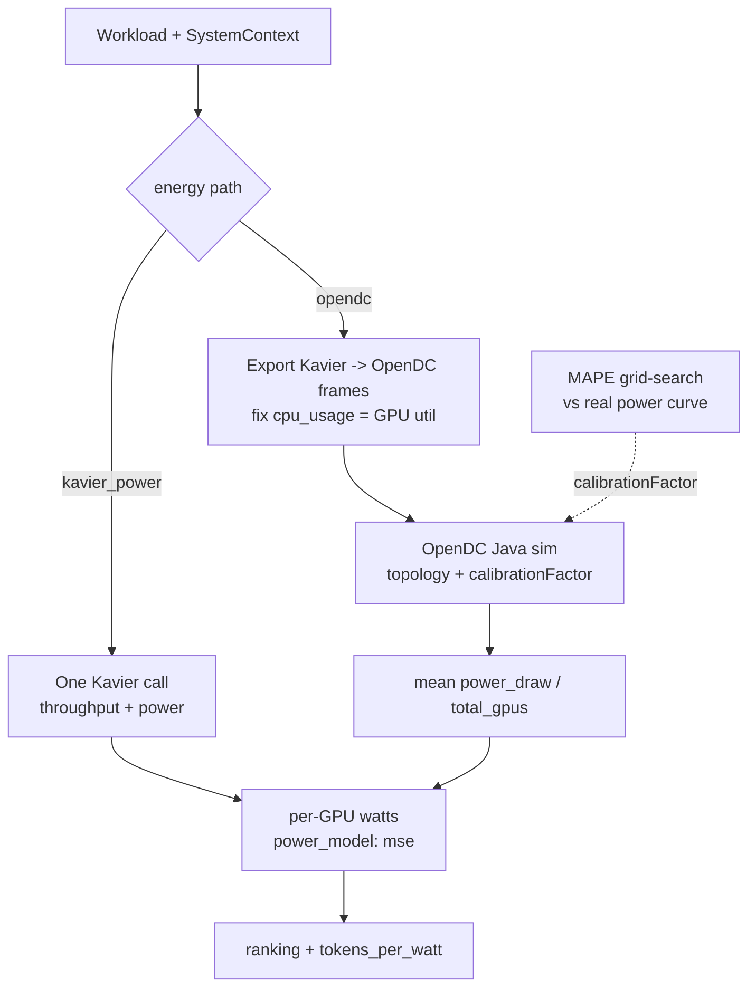

# Energy predictors

Coastline turns each candidate config into a **per-GPU power** figure that feeds ranking, `tokens_per_watt`, and whole-cluster energy. Two interchangeable paths ship: analytical `kavier_power` and simulated `opendc`.

## Overview {#overview}

- **`kavier_power`** (default) — analytical MSE power model. `KavierPowerPredictor` wraps [`KavierPredictor`](performance.md): one Kavier call returns throughput **and** per-GPU watts together, tagged `"power_model": "mse"`. No pickles, no external runtime.
- **`opendc`** — datacenter simulation. Exports the Kavier workload to OpenDC frames, runs the OpenDC Java simulator, and averages its `power_draw` trace. Needs a built runner at `OPENDC_BIN_PATH`. A `calibrationFactor` is grid-searched offline against a real power curve by lowest MAPE.

Both report **per-GPU** watts so ranking treats them identically; OpenDC's total-datacenter draw is divided by `total_gpus` before it leaves the predictor.

## How to use it {#use}

### config

Select the energy path in the `predictors` block:

```yaml
predictors:
  performance: kavier      # throughput
  energy: kavier_power     # or: opendc
```

### SDK

```python
from coastline.sdk.predictors.energy.kavier import KavierPowerPredictor
from coastline.sdk.models.workload import WorkloadSpec
from coastline.sdk.models.context import SystemContext

pred = KavierPowerPredictor()
out = pred.predict(WorkloadSpec(...), SystemContext(...))
print(out.predicted_power)  # per-GPU watts
```

!!! tip "One engine call"
    `KavierPowerPredictor` sets `WRAPS_THROUGHPUT_ENGINE = True`. When throughput is also Kavier, the pipeline reuses that single call's power and **skips a second run** — one engine call per candidate, not two. See [pipeline](pipeline.md).

OpenDC is drop-in:

```python
from coastline.sdk.predictors.energy.opendc.predictor import OpenDCEnergyPredictor
pred = OpenDCEnergyPredictor(opendc_bin_path="/path/to/opendc")
```

## Architecture {#architecture}



## Formulas {#formulas}

**E1 — Power draw (OpenDC MSE model)**
*Source:* [Fan et al. (2007)](https://doi.org/10.1109/ISCA.2007.18); [Mastenbroek et al. (2021)](https://doi.org/10.1109/CCGrid51090.2021.00069).

$$P(u) = P_\text{idle} + (P_\text{max}-P_\text{idle})\,(2u - u^{\,r})$$

- $u = \max(\text{compute}, \text{memory})$ utilisation; $r$ = `calibration_factor` (=1.0 for shipped GPUs → linear idle→max ramp).
- $P_\text{idle}$, $P_\text{max}$ are per-GPU specs scaled by `total_gpus` in `topology.py` (e.g. A100-80GB: 75 W idle, 400 W TDP).

**E2 — Energy over the full run**
*Source:* [Fan et al. (2007)](https://doi.org/10.1109/ISCA.2007.18).

$$\text{energy\_kWh} = \frac{P(u)\times\text{total\_gpus}\times\text{runtime\_s}}{3.6\times10^{6}}$$

$$\text{tokens\_per\_watt} = \frac{\text{throughput}}{\text{power}}$$

- `power_watts` is **per-GPU**; `energy_kwh` is whole-cluster over the full dataset run.

**E3 — Per-Mtoken efficiency**
*Source:* [Niewenhuis et al. (2024)](https://doi.org/10.1145/3578244.3583730).

$$\text{Wh\_per\_Mtoken} = \frac{\sum \text{energy\_Wh}}{\text{total\_tokens}}\times 10^{6}$$

## Contributing {#contribute}

- `src/coastline/sdk/predictors/energy/kavier/kavier_power_predictor.py` — analytical adapter (`WRAPS_THROUGHPUT_ENGINE`).
- `src/coastline/sdk/predictors/energy/opendc/predictor.py` — OpenDC export → sim → per-GPU watts (strict, no fallbacks).
- `src/coastline/sdk/predictors/energy/opendc/calibration.py` — `calibrationFactor` MAPE sweep (in-sample).
- `src/coastline/sdk/predictors/energy/opendc/mape.py` — simulated-vs-actual MAPE on a 60 s grid.
- `src/coastline/sdk/io/odc_runner/topology.py` — GPU power specs + MSE topology JSON.
- Tests: `tests/test_predictors/` (`test_energy_predictors`, `test_opendc_energy`, `test_opendc_calibration`).

!!! warning "OpenDC needs a Java runner"
    The `opendc` path requires a **built** OpenDC simulator binary at `OPENDC_BIN_PATH`. Without it `OpenDCEnergyPredictor` raises `OpenDCRunnerError` — there are no fallbacks. Use `kavier_power` if you have no runner.

```bash
uv run pytest tests/test_predictors -k "energy or opendc"
```
