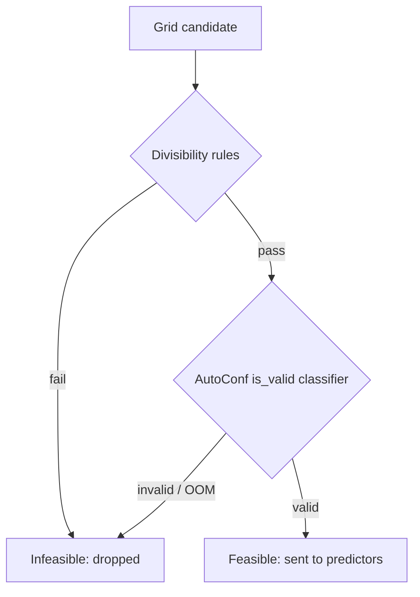

# Feasibility

The safety gate of the [pipeline](pipeline.md): it drops candidate configurations that would run out of memory or violate divisibility constraints **before** any throughput/energy prediction runs, so the ranker only ever sees runnable layouts.

## Overview {#overview}

Every grid candidate passes through a feasibility checker before it reaches the [predictors](performance.md). Two modes ship:

- **`autoconf`** (default) — OOM-aware. Runs cheap divisibility rules first, then the ADO AutoConf validity classifier.
- **`rules`** — divisibility constraints only (no OOM check).

`autoconf` **fail-closes**: if the `ado-autoconf` package cannot be imported, the run raises rather than silently skipping the OOM veto. Set `COASTLINE_ALLOW_RULES_FALLBACK=1` to knowingly degrade to `rules`. A `none` mode (accept-all) exists for tests.

## How to use it {#use}

### config

Select the mode in the `predictors:` block:

```yaml
predictors:
  performance: intelligent
  energy: kavier_power
  feasibility: autoconf   # autoconf | rules | none
  autoconf_model_version: "3.1.0"   # optional, default shown
```

### SDK

`feasibility` is a constructor kwarg on the configured recommender:

```python
import coastline

rec = coastline(throughput_estim="kavier", feasibility="autoconf")
best = rec.recommend(
    {"llm_model": "llama-3-8b", "fine_tuning_method": "lora",
     "gpu_model": "A100", "tokens_per_sample": 512, "batch_size": 16},
    top_k=5,
)
```

!!! tip
    `_RulesThenAutoconfChecker` short-circuits on the cheap divisibility rules first, so obviously-invalid layouts never pay the AutoConf model-load/predict cost.

## Architecture {#architecture}

The checker is assembled by `create_feasibility_checker(predictor_config)` from the `predictors.feasibility` mode. In `autoconf` mode it wraps rules + classifier in series.



## Model card {#formulas}

This gate is a **classifier**, not a closed-form model.

**AutoConf — `is_valid` OOM predictor**
IBM's open-source [`ado-autoconf`](https://github.com/IBM/ado) plugin: an AutoGluon-based classifier (model version `3.1.0`) trained on the fine-tuning profiling trace. Given a `(workload, layout)` job config — `model_name`, `method`, `gpu_model`, `tokens_per_sample`, `batch_size`, `number_gpus` — it predicts whether the run completes **without OOM** (`valid_flag == 1`). Coastline passes `workload.feasibility_model` (falling back to `llm_model`) so the OOM check can use the real model even when the perf predictor runs a proxy.
*Source:* [IBM ADO Team (2024)](https://github.com/IBM/ado) — AutoConf experiment plugin.

- Installs via the extra `coastline[autoconf]` (a.k.a. `coastline-recommender[autoconf]`) — **not** `pip install autoconf`, which is an unrelated PyPI package. Needs Python ≥ 3.10.
- A load/predict failure is logged and treated as infeasible (the grid continues); an invalid `JobConfig` is a benign reject.

**Divisibility rules**
Constraint-only check: `total_gpus >= 1` and `batch_size % total_gpus == 0`. No memory modelling.

!!! warning
    `feasibility: autoconf` **fail-closes**. If the AutoConf model cannot load, the run raises a `RuntimeError` instead of silently bypassing the OOM veto. Only `COASTLINE_ALLOW_RULES_FALLBACK=1` degrades it to divisibility-only `rules` — accept the loss of OOM protection deliberately.

## Contributing {#contribute}

- Checkers + classifier wrapper: `src/coastline/sdk/predictors/feasibility/autoconf.py` (`AutoconfFeasibilityChecker`, `RulesFeasibilityChecker`, `NoOpFeasibilityChecker`)
- Factory + rules-then-autoconf composition: `src/coastline/sdk/pipeline/feasibility.py` (`create_feasibility_checker`, `_RulesThenAutoconfChecker`)
- Tests: `tests/test_predictors/test_autoconf_feasibility.py`

```bash
uv run pytest tests/test_predictors/test_autoconf_feasibility.py
```
