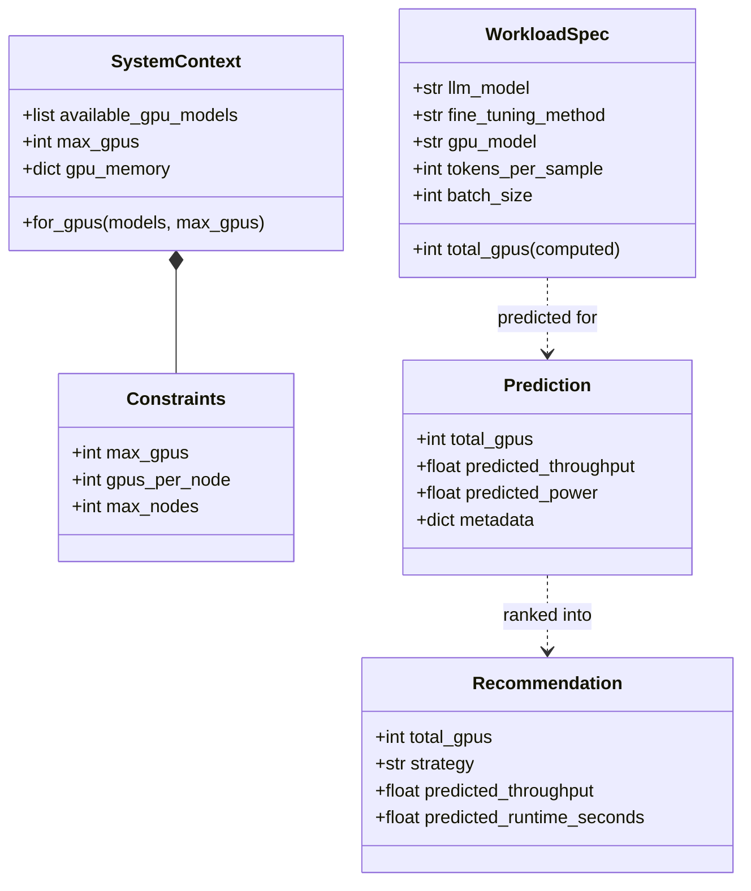

# Library & data models

Coastline's static reference layer: the GPU specs database and physics constants in `sdk/library`, plus the shared pydantic data models in `sdk/models` that every predictor, policy, and pipeline stage speaks.

## Overview {#overview}

Two things live here:

1. **GPU specs DB + physics constants** (`sdk/library/hardware.py`) — `GPU_SPECS` maps a GPU model name to `memory_gb`, `tdp_watts`, `idle_watts`, `compute_tflops_fp16`, `memory_bandwidth_gbps`, `nvlink_bandwidth_gbps`. Typed getters (`get_gpu_memory`, `get_gpu_tdp`, `get_gpu_idle_power`) raise `UnsupportedGPUError` on unknown models — no silent defaults. Constants: `IDLE_POWER_RATIO`, `MFU_*`, `LOGP_*`.
2. **Shared pydantic models** (`sdk/models`) — `WorkloadSpec`, `SystemContext`, `Constraints`, `Prediction`, `Recommendation`. The common vocabulary across the [pipeline](pipeline.md) and all predictors.

!!! note
    Deep per-LLM / per-GPU spec tables for the ML feature rows come from **kavier_library** (Kavier's public spec tables), not from this DB.

## How to use it {#use}

### SDK

```python
from coastline.sdk.library.hardware import GPU_SPECS, get_gpu_memory
from coastline.sdk.models.workload import WorkloadSpec
from coastline.sdk.models.context import SystemContext

get_gpu_memory("A100-SXM4-80GB")        # -> 80
list(GPU_SPECS)                          # supported GPU model names

wl = WorkloadSpec(
    llm_model="mistralai/Mistral-7B-v0.1",   # canonicalized -> "mistral-7b-v0.1"
    fine_tuning_method="lora",
    gpu_model="A100-SXM4-80GB",
    tokens_per_sample=2048,
    batch_size=8,
)

ctx = SystemContext.for_gpus(
    ["A100-SXM4-80GB", "L40S"], max_gpus=32, gpus_per_node=8,
)   # derives gpu_memory + max_nodes (ceil) automatically
```

!!! tip
    `WorkloadSpec.llm_model` is canonicalized at ingestion (org prefix dropped, lowercased) so the cache, Kavier physics, AutoConf, and ML predictors all see the same short key. `total_gpus` is a computed field: `gpus_per_node × number_of_nodes`.

## Architecture {#architecture}



## Reference {#formulas}

GPU spec fields and where they feed:

| Spec field | Unit | Feeds |
|---|---|---|
| `memory_gb` | GB | [feasibility](feasibility.md) OOM check |
| `tdp_watts` | W | [energy E1](energy.md#formulas) |
| `idle_watts` | W | [energy E1](energy.md#formulas) |
| `compute_tflops_fp16` | TFLOP/s | [performance F1 / roofline](performance.md#formulas) |
| `memory_bandwidth_gbps` | GB/s | [performance F1 / roofline](performance.md#formulas) |
| `nvlink_bandwidth_gbps` | GB/s | comm / all-reduce modeling |

Physics constants (`hardware.py`):

- `IDLE_POWER_RATIO = 0.25` — idle-to-TDP floor (75W/400W, rounded up for margin).
- `LOGP_LATENCY_US = 5.0`, `LOGP_OVERHEAD_US = 2.0` — LogP comm-model params (NVLink 3.0, DGX A100 / NCCL 2.x).
- `MFU_BATCH_ALPHA = 0.8`, `MFU_SEQ_GAMMA = 0.9`, `MFU_MODEL_BETA = 0.85` — MFU efficiency-degradation exponents.

## Contributing {#contribute}

- Add a GPU: append an entry to `GPU_SPECS` in `src/coastline/sdk/library/hardware.py` using NVIDIA datasheet values (all six fields; use `0` for `nvlink_bandwidth_gbps` on PCIe cards).
- Add a validating test under `tests/test_library/` or `tests/test_models/`.
- Data model changes: `src/coastline/sdk/models/{workload,context,recommendation}.py`.

```bash
uv run pytest tests/test_models tests/test_library
```
