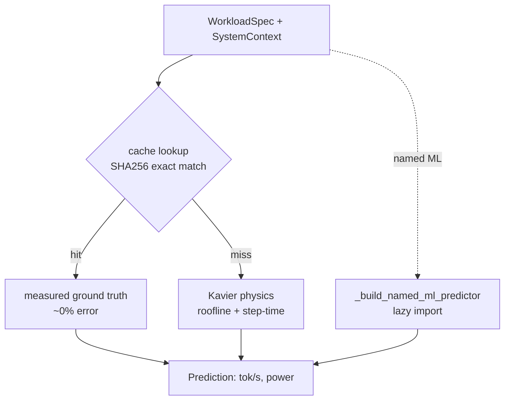

# Performance predictors

Throughput estimators that turn a `WorkloadSpec` into a tokens/sec `Prediction`. Four families sit behind a common `BasePredictor` interface, resolved by name through the [policies](policies.md) `PolicyFactory` and consumed by the [pipeline](pipeline.md).

## Overview {#overview}

Four throughput families implement the same `predict(workload, context) -> Prediction | None` contract:

- **physics** — `KavierPredictor`, analytical roofline/step-time model (also returns power).
- **retrieval** — `RetrievalPredictor`, SHA256 exact-match cache over the measured run database (~0% error on a hit, `None` on a miss).
- **data_driven** — a zoo of 10 trained ML models (XGBoost, TabPFN, CatBoost, …).
- **composite** — `CacheThenPhysicsPredictor`, the default `"intelligent"`.

The default `"intelligent"` cascades cache → Kavier: an exact hit of a real past run wins, else physics. Its display name is `"intelligent (cache→kavier)"`.

## How to use it {#use}

### SDK

```python
import coastline

workload = {
    "llm_model": "granite-3-8b", "gpu_model": "NVIDIA-A100-80GB-PCIe",
    "fine_tuning_method": "lora", "tokens_per_sample": 2048, "batch_size": 16,
}

# Pick the estimator once, then call per workload.
recs = coastline(throughput_estim="kavier")(workload)      # physics only
recs = coastline(throughput_estim="intelligent")(workload) # cache → kavier (default)
recs = coastline(throughput_estim="cache")(workload)       # retrieval only
recs = coastline(throughput_estim="tabpfn")(workload)      # a named ML model

print(recs[0].predicted_throughput)
```

!!! note
    Named ML models resolve lazily via `_build_named_ml_predictor` — the heavy backend (torch, xgboost, tabpfn, …) is imported only when that name is selected, so unused runtimes never load.

## Architecture {#architecture}



!!! note
    `_build_named_ml_predictor` lazy-imports one of `{xgboost, lightgbm, catboost, random_forest, svr, knn, gaussian_process, bayesian_ridge, tabpfn, deep_learning}`. `"intelligent"` is the `CacheThenPhysicsPredictor` cascade shown above; a cache miss falls through to Kavier per configuration.

## Formulas {#formulas}

This page references Kavier's physics; it does not re-derive it (see the Kavier docs).

**F1 — Roofline**
$$\text{throughput} = \min(\text{peak\_FLOP/s},\ \text{bandwidth} \times \text{arithmetic\_intensity})$$
*Source:* [Williams et al. (2009)](https://doi.org/10.1145/1498765.1498785).

- Compute-bound below the ridge point, bandwidth-bound above it.

**T5 — Step time & throughput**
$$T_\text{step} = G_a(T_\text{fwd}+T_\text{bwd}) + T_\text{opt} + T_\text{comm}$$
$$\text{tok/s} = \frac{G_a \cdot \text{batch}\cdot\text{seq}\cdot N}{\text{mgc}\cdot T_\text{step}} \times \text{method\_scale}\cdot\text{model\_scale}$$
*Source:* [Shoeybi et al. (2019)](https://arxiv.org/abs/1909.08053); Narayanan.

- $G_a$ = gradient-accumulation steps; `mgc` = micro-batches per global batch.
- `method_scale` captures PEFT ([LoRA](https://arxiv.org/abs/2106.09685) / [QLoRA](https://arxiv.org/abs/2305.14314)); `model_scale` the architecture calibration.

**T6 — MFU (batch-scaled)**
$$\text{MFU} = \text{base\_MFU}\cdot\text{per\_GPU\_cal}\cdot\min(1,\ 0.0341\log_2(\text{batch})+0.8147)$$
*Source:* [Chowdhery et al. (2022)](https://arxiv.org/abs/2204.02311); [Williams et al. (2009)](https://doi.org/10.1145/1498765.1498785).

- Model FLOP utilisation grows with batch, saturating at 1.0.

**T4 — Comm (ring all-reduce)**
$$T_\text{comm} = c_\text{cal}\left[\text{lat}\log_2 N + \text{ovh}(N{-}1) + \frac{\text{grad\_bytes}(N{-}1)/N}{\text{bw}}\right]$$
*Source:* [Thakur et al. (2005)](https://doi.org/10.1177/1094342005051521).

- $N$ = total GPUs; the $(N{-}1)/N$ factor is the ring all-reduce bandwidth term. See [ZeRO](https://arxiv.org/abs/1910.02054) for gradient sharding.

### Model cards

Data-driven models trained on the run database (`featv3` schema in `ml_common.py`); throughput MdAPE on a 15% holdout:

| Predictor | Name | Throughput MdAPE |
|---|---|---|
| TabPFN | `tabpfn` | 2.1% |
| XGBoost | `xgboost` | 7.2% |
| CatBoost | `catboost` | 8.4% |
| LightGBM | `lightgbm` | 9.1% |
| **intelligent** (default) | `intelligent` | cache 0% → Kavier 6.2% |

!!! note
    The parametric models (catboost, xgboost, lightgbm, bayesian_ridge, deep_learning) ship bundled in the wheel; the large/instance-based ones (tabpfn, random_forest, knn, gaussian_process, svr) do not — point `PORTFOLIO_DIR` at a `models/` dir or retrain them with `python -m trainer.main --model <name>` (the dev-only `dev/trainer`, `dev/` on `PYTHONPATH`). Heavy ML backends live in the `[ml]` extra. Without `kavier_library`, spec-dependent ML predictors return `None`.

## Contributing {#contribute}

- Implement `BasePredictor.predict()` in `src/coastline/sdk/predictors/base.py`.
- Add predictor modules under `src/coastline/sdk/predictors/performance/` (`physics/`, `retrieval/`, `data_driven/`, `composite.py`).
- Register a new ML name in the lazy map `_build_named_ml_predictor` in `src/coastline/sdk/policies/__init__.py`.
- Shared ML feature/inference helpers: `src/coastline/sdk/predictors/performance/data_driven/ml_common.py`.
- Tests live in `tests/test_predictors/`; mark native-backend tests `ml_isolated` (they crash if co-loaded — separate interpreter).

```bash
uv run pytest tests/test_predictors
uv run pytest -m ml_isolated -p no:cacheprovider
```
