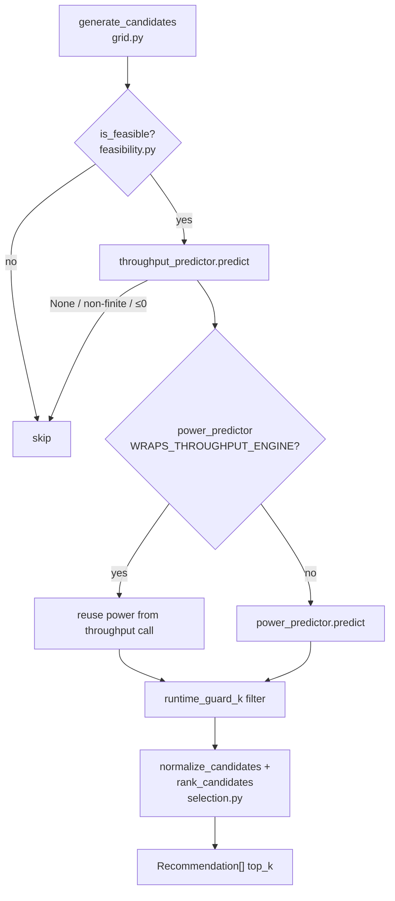

# Recommendation pipeline

The pipeline is Coastline's core loop: a single `GridWorkflowPipeline` that turns a workload + system context into a ranked `Recommendation[]` via **grid → feasibility → predict → rank**.

## Overview {#overview}

Given a `workload` and a `SystemContext`, the pipeline grid-searches candidate configs, drops infeasible ones, predicts throughput and power, then ranks the survivors. It is a linear, single-pass loop — no backtracking. Internally every recommendation carries the workflow tag `grid_feasibility_simulate_policy` in its metadata.

One `GridWorkflowPipeline` (`workflow.py`) wraps **both** strategies (`multi_objective`, `min_gpu`); they differ only in selection policy and weights. `PolicyFactory` (`policies/__init__.py`) is the single source of truth for resolving predictor names to objects — the workflow delegates back to it rather than duplicating resolution.

## How to use it {#use}

### SDK

A config dict flows through `PolicyFactory.create_strategy(...)`, whose `.recommend()` runs the pipeline:

```python
from coastline.sdk.policies import PolicyFactory
from coastline.sdk.models.workload import WorkloadSpec
from coastline.sdk.models.context import SystemContext

config = {
    "strategy": {"name": "multi_objective", "preset": "balanced"},
    "predictors": {"performance": "intelligent", "energy": "kavier_power", "feasibility": "autoconf"},
    "grid": {"batch_sizes": [4, 8, 16], "total_gpus": [1, 2, 4, 8], "top_k": 5},
}

strategy = PolicyFactory.create_strategy(config=config)
recs = strategy.recommend(workload, context)  # -> List[Recommendation], best first
```

### CLI

```bash
coastline run --config config/coastline_functionality/default.yaml
```

Writes a `recommendation.json` run artifact under `recommender/runs/<run_id>/`.

!!! note
    With no config, `PolicyFactory.load_config()` tries `experiment.yaml`, then `default.yaml`, then a built-in default.

## Architecture {#architecture}



!!! tip
    When the power predictor sets `WRAPS_THROUGHPUT_ENGINE` (Kavier), the power returned alongside throughput is reused — one engine call, not two.

## Formulas {#formulas}

The grid is the Cartesian product of batch sizes and total GPU counts; the node layout is auto-derived from `total_gpus` (pack GPUs per node, then `ceil` to node count), clipped to context limits.

**Grid — candidate set**
$$
\mathcal{G} = \{\, \text{batch\_sizes} \,\} \times \{\, \text{total\_gpus} \,\}
$$
*Source:* `grid.py`; Megatron-LM [Shoeybi et al. (2019)](https://arxiv.org/abs/1909.08053).

- `gpus_per_node = min(total_gpus, max_gpus_per_node)`, `number_of_nodes = ceil(total_gpus / gpus_per_node)`.
- Candidates exceeding `context.max_gpus` or `max_nodes` are dropped before predicting.

**Runtime guard — SLO filter**
$$
\text{keep } c \iff \text{throughput}(c) \;\ge\; \frac{\max_j \text{throughput}(j)}{k}
$$
*Source:* `workflow.py` (`runtime_guard_k`, `strategy.max_slowdown`).

- Drops any candidate slower than `k×` the fastest feasible one (a runtime-ratio filter). Off by default; falls back to the full set if the filter would empty it.
- Combined with the feasibility gate (divisibility + OOM), these are the two config-driven safeguards.

**Derived metrics**
$$
\text{runtime}_s = \frac{\text{total\_tokens}}{\text{throughput}}, \qquad
\text{tokens\_per\_watt} = \frac{\text{throughput}}{\text{power}}
$$
*Source:* `workflow.py` (`_to_recommendation`).

- The α/β weighted-sum ranking math lives on the [policies](policies.md#formulas) page; `selection.py` here only min-max normalizes power and time axes into `[0,1]`.

## Contributing {#contribute}

- Grid generation + node layout: `src/coastline/sdk/pipeline/grid.py`
- Feasibility factory (autoconf / rules / none): `src/coastline/sdk/pipeline/feasibility.py`
- Normalization + ranking: `src/coastline/sdk/pipeline/selection.py`
- Core loop + safeguards: `src/coastline/sdk/pipeline/workflow.py`
- Predictor resolution (single source of truth): `src/coastline/sdk/policies/__init__.py`
- Tests: `tests/test_pipeline/`

```bash
uv run pytest tests/test_pipeline
```
