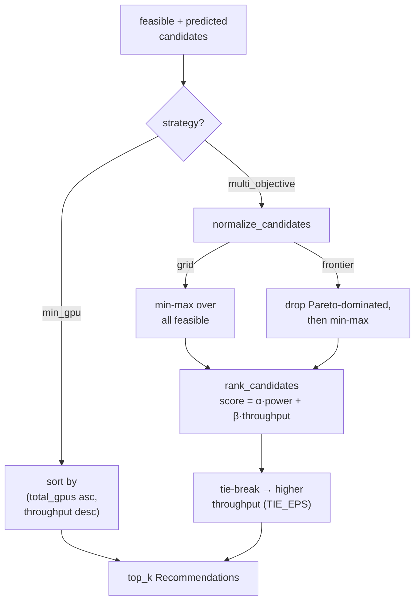

# Ranking policies

Once the [pipeline](pipeline.md) has filtered infeasible configs and predicted throughput + power for the survivors, a **policy** turns that set into a ranked list of [`Recommendation`](library.md)s. Two strategies exist: `min_gpu` and `multi_objective`.

## Overview {#overview}

Chosen via `strategy.name` in config (or the SDK `strategy=` arg):

- **`min_gpu`** — pick the fewest feasible GPUs; throughput only breaks ties. Bypasses scalar scoring entirely.
- **`multi_objective`** — rank on a weighted throughput↔energy score. A **preset** (`balanced`, `performance`, `energy`) maps to fixed $(\alpha,\beta)$ weights, or set `alpha`/`beta` explicitly. Each preset has a `-frontier` variant that min-max normalizes over the Pareto-non-dominated set instead of all feasible candidates.

!!! note
    Explicit `alpha`/`beta` always win over a preset; a one-sided weight derives its complement ($\beta = 1-\alpha$), and weights are re-normalized to sum to 1.

## How to use it {#use}

### config

```yaml
strategy:
  name: multi_objective   # or: min_gpu
  preset: energy          # balanced | performance | energy (+ -frontier variants)
  # alpha: 0.7            # optional: explicit power weight (overrides preset)
  # beta: 0.3             # optional: explicit throughput weight
```

`min_gpu` ignores `preset`/`alpha`/`beta`.

### SDK

```python
import coastline

rec = coastline(throughput_estim="kavier")           # configured recommender
top = rec.recommend(workload, preset="energy")        # or strategy="min_gpu"
top = rec.recommend(workload, alpha=0.7, beta=0.3)    # explicit weights
```

`recommend(...)` returns a best-first `list[Recommendation]` (`top_k=5` default).

!!! tip
    `preset="energy-frontier"` keeps the energy weights but normalizes only over the Pareto frontier — useful when the full grid has many dominated configs skewing the min-max range.

## Architecture {#architecture}



`normalize_candidates` fills `power_score`/`throughput_score` in $[0,1]$; `rank_candidates` combines and sorts. `min_gpu` skips both scoring steps.

## Formulas {#formulas}

**Preset weights** ($\alpha$ = power weight, $\beta$ = throughput weight)

| preset | $\alpha$ | $\beta$ |
|---|---|---|
| `energy` | 0.8 | 0.2 |
| `balanced` | 0.5 | 0.5 |
| `performance` | 0.2 | 0.8 |

**Cost axes** (lower is better)

$$\text{power\_cost} = \text{power}\times\text{total\_gpus}, \qquad \text{time\_cost} = 1/\text{throughput}$$

**Min-max normalization to [0,1]** (higher = better)

$$\text{power\_score} = \frac{p_\max - \text{power\_cost}}{p_\max - p_\min}, \quad \text{throughput\_score} = \frac{t_\max - \text{time\_cost}}{t_\max - t_\min}$$

**Combined score** (ranked descending)

$$\text{score} = \alpha\cdot\text{power\_score} + \beta\cdot\text{throughput\_score}$$

*Source:* min-max multi-objective scalarization; [Pareto dominance](https://en.wikipedia.org/wiki/Pareto_efficiency). Project-internal scoring — no external paper.

- Work is config-invariant, so it cancels in the $1/\text{throughput}$ min-max; a degenerate range ($p_\max = p_\min$) yields score $1.0$.
- Near-ties (`TIE_EPS = 0.01`) break toward higher throughput; `min_gpu` instead sorts by `(total_gpus asc, throughput desc)`. Frontier mode zeroes dominated candidates before ranking.

## Contributing {#contribute}

- Strategies: `src/coastline/sdk/policies/min_gpu.py`, `src/coastline/sdk/policies/multi_objective.py`, `src/coastline/sdk/policies/__init__.py` (`PolicyFactory` — preset/weight resolution)
- Scoring core: `src/coastline/sdk/pipeline/selection.py` (`PRESET_WEIGHTS`, `normalize_candidates`, `rank_candidates`)
- Tests: `tests/test_policies/`

```bash
uv run pytest tests/test_policies
```
