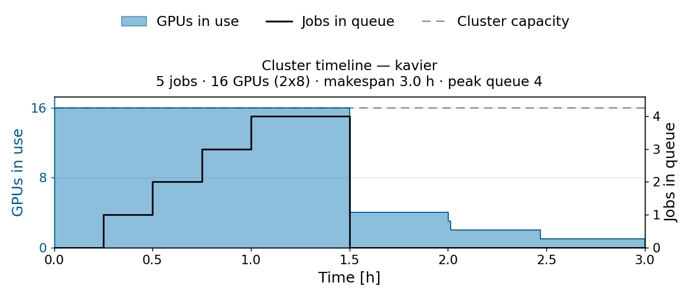
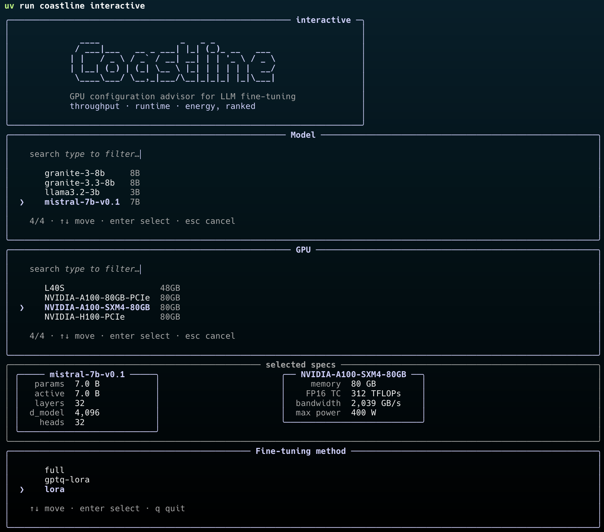

# Command-line interface for Coastline

The `coastline` binary provides several sub-commands you can use in your recommendation pipeline.
See the help page below for an overview:

```
usage: coastline <command> [options]

commands:
  recommend        Batch-recommend GPU/node configs for a CSV of workloads (CSV in -> CSV out).
  run              Run one config-file experiment; write a recommendation.json run artifact.
  recommend-trace  Recommend a config for every job in a fine-tuning trace CSV.
  plot-trace       Plot a recommended trace: cluster timeline, GPUs in use + jobs queued ([plot] extra).
  interactive      Guided keyboard-driven REPL over the recommender.
  tune             Tune a data-driven predictor (tabpfn) on your own measured-runs CSV ([ml] extra).

Run `coastline <command> --help` for command-specific options.
```

!!! note
    Note that the `coastline plot-trace` requires the additional `coastline-recommender[plot]` module and `coastline tune` requires `coastline-recommender[ml]`.
    Refer to the [installation](installation.md) guide for further details on the extra modules.

## Recommend

The `coastline recommend` command reads a CSV of workloads and, for every row, sweeps the configuration grid, filters infeasible configurations, predicts throughput and power, and writes the best-ranked configuration to an output CSV. 
The recommendation policy, simulation models, grid, and safeguards are all declared in the config file.

Use it when you have many workloads to recommend at once: 
[`coastline run`](#run) handles a single workload, and 
[`coastline recommend-trace`](#recommend-trace) expects the fine-tuning trace format.


```bash
coastline recommend \
      --config batch_config.yaml \
      --input sample_workloads.csv \
      --output recommendations.csv
```

=== "batch_config.yaml"

    ```yaml
    strategy:
      name: multi_objective    # how candidates are ranked; alt: min_gpu (fewest feasible GPUs)
      preset: balanced         # throughput-vs-energy weighting; alt: performance, energy
      max_slowdown: 2.0        # SAFEGUARD: never recommend a config slower than 2x the
                               # fastest feasible one. Omit for no slowdown cap.
    
    predictors:
      performance: kavier      # analytical engine; alt: tabpfn/catboost/... (needs the [ml] extra)
      energy: kavier_power
      feasibility: rules       # divisibility-only; keeps this example cheap.
                               # Production default is `autoconf` (OOM-aware; ships in the core install).
    
    grid:                      # search space swept per workload row
      gpu_models: ["NVIDIA-A100-SXM4-80GB"]
      batch_sizes: [4, 8, 16, 32]
      total_gpus: [1, 2, 4, 8, 16]
    ```

=== "sample_workloads.csv"
    ```csv
    model_name,method,gpu_model,tokens_per_sample,batch_size
    mistral-7b-v0.1,lora,NVIDIA-A100-SXM4-80GB,1024,16
    granite-3.3-8b,full,NVIDIA-A100-SXM4-80GB,4096,4
    granite-3.1-2b,lora,NVIDIA-A100-SXM4-80GB,1024,16
    ```

=== "recommendations.csv"
    Note that when setting up your experiment, you do not need to copy over this file.
    Below is an example output (the `--output` flag produces this file).

    ```csv
    model_name,method,gpu_model,tokens_per_sample,batch_size,recommended_total_gpus,recommended_gpus_per_node,recommended_number_of_nodes,recommended_batch_size,predicted_throughput,predicted_runtime_seconds,predicted_power_watts,tokens_per_watt,feasible,rationale
    mistral-7b-v0.1,lora,NVIDIA-A100-SXM4-80GB,1024,16,8,8,1,32,37577.52855076191,,220.84667948500874,170.15211022592126,True,"8 GPUs (8×1, batch 32) picked for the best throughput-vs-energy balance, 4% faster than the runner-up (8 GPUs, batch 16)."
    granite-3.3-8b,full,NVIDIA-A100-SXM4-80GB,4096,4,8,8,1,32,20890.745742833682,,220.84667948500874,94.59388654404361,True,"8 GPUs (8×1, batch 32) picked for the best throughput-vs-energy balance, 4% faster than the runner-up (8 GPUs, batch 16)."
    granite-3.1-2b,lora,NVIDIA-A100-SXM4-80GB,1024,16,8,8,1,32,50610.71190113843,,220.84667948500874,229.16673240982067,True,"8 GPUs (8×1, batch 32) picked for the best throughput-vs-energy balance, 4% faster than the runner-up (8 GPUs, batch 16)."
    ```

## Run

The `coastline run` command runs one declared experiment: unlike in `coastline recommend`, here the config file carries the workload itself, next to the recommendation policy, simulation models, and grid, so a single file fully specifies the run. 
The command prints the recommendation as JSON; with `--output-dir` it also writes it as a `recommendation.json` run artifact.

Use it when you want a single, reproducible, declared experiment: 
[`coastline recommend`](#recommend) takes a CSV with many workloads, and 
[`coastline interactive`](#interactive) explores single workloads without writing a config file.


```bash
coastline run --config config.yaml
```

=== "config.yaml"

    ```yaml
    workload:
      llm_model: "mistral-7b-v0.1"        # model to fine-tune
      fine_tuning_method: "lora"          # PEFT: full, lora, gptq-lora
      tokens_per_sample: 2048             # sequence length
      batch_size: 8                       # seed per-device batch
      gpus_per_node: 8                    # GPUs per node
      number_of_nodes: 1                  # node count

    system:
      default_gpu: "NVIDIA-A100-SXM4-80GB"  # fallback GPU if grid.gpu_models is empty

    strategy:
      name: "multi_objective"   # or min_gpu
      preset: "balanced"        # throughput-vs-energy weighting

    predictors:
      performance: "intelligent"   # ML with Kavier fallback; alt: kavier, cache, or model name
      energy: "kavier_power"       # analytical power model
      feasibility: "autoconf"      # OOM-aware AutoConf checker
      lookup: "default"            # measured-runs DB for cache/intelligent: a CSV path, or
                                   # "default" = the bundled sample (sfttrainer runs, ±3% jitter)

    grid:
      gpu_models:
        - "NVIDIA-A100-SXM4-80GB"
      batch_sizes: [4, 8, 16, 32, 64]
      total_gpus: [1, 2, 4, 8, 16]
      top_k: 3
    ```

=== "recommendation.json"
    Note that when setting up your experiment, you do not need to copy over this file.
    Below is an example output (printed to stdout; the `--output-dir` flag also writes it to this file).

    ```json
    {
      "timestamp": "2026-07-12T17:52:15.803645",
      "configuration": {
        "total_gpus": 4,
        "gpus_per_node": 4,
        "workers": 1
      },
      "strategy": "multi_objective_balanced",
      "performance": {
        "throughput_tokens_per_sec": 15091.68
      },
      "energy": {
        "power_watts": 223.04,
        "efficiency_tokens_per_watt": 67.66
      },
      "metadata": {
        "predicted_power_watts": 223.04,
        "combined_score": 0.82,
        "rank": 1,
        "selection_policy": "balanced",
        "tokens_per_watt": 67.66,
        "throughput_score": 0.84,
        "power_score": 0.8,
        "feasibility": {
          "Rule-Based Classifier error": "",
          "Predictive Model Classifier error": null
        },
        "batch_size": 64,
        "workflow": "grid_feasibility_simulate_policy",
        "preset": "balanced",
        "alpha": 0.5,
        "beta": 0.5
      }
    }
    ```

## Recommend-trace

The `coastline recommend-trace` command recommends a configuration for every job in a fine-tuning trace — a CSV with one recorded training job per row — staying within each job's own GPU allocation. 
The command rewrites the GPU layout and batch size to the recommended ones and appends the predicted duration (`metadata.estimated_duration_kavier`). 
Jobs Coastline cannot recommend keep the original configuration and the observed duration, and the `metadata.recommendation_note` column states the reason.

Use it when you have a recorded trace of fine-tuning jobs and want to replay the trace with recommended configurations: 
[`coastline recommend`](#recommend) takes a plain workload CSV instead, and 
[`coastline plot-trace`](#plot-trace) draws the cluster timeline of the result.

The command needs no config file: the `--method` flag selects the performance predictor (default: `kavier`), and the `--goal` flag selects the recommendation policy — `min_gpu` (default) recommends the fewest GPUs that fit, and `performance` favours throughput.


```bash
coastline recommend-trace \
      --input sample_trace.csv \
      --output recommended_trace.csv
```

=== "sample_trace.csv"
    ```csv
    metadata.model_name,metadata.method,resources.gpu_model,metadata.tokens_per_sample,metadata.batch_size,resources.num_gpus_per_node,resources.num_nodes,metadata.output.train_tokens_per_second,metadata.train_runtime,metadata.submission_time
    llama3.1-70b,full,NVIDIA-A100-SXM4-80GB,2048,8,8,2,1150,5400,2026-03-02T09:00:00Z
    mistral-7b-v0.1,lora,NVIDIA-A100-SXM4-80GB,1024,16,8,1,3900,3600,2026-03-02T09:15:00Z
    granite-3.3-8b,full,NVIDIA-A100-SXM4-80GB,4096,4,8,2,8800,1800,2026-03-02T09:30:00Z
    granite-3.1-2b,lora,NVIDIA-A100-SXM4-80GB,1024,16,4,1,15000,1000,2026-03-02T09:45:00Z
    mistral-7b-v0.1,lora,NVIDIA-A100-SXM4-80GB,2048,8,8,1,2600,2770,2026-03-02T10:00:00Z
    ```

=== "recommended_trace.csv"
    Note that when setting up your experiment, you do not need to copy over this file.
    Below is an example output (the `--output` flag produces this file).

    ```csv
    metadata.model_name,resources.gpu_model,resources.num_gpus_per_node,resources.num_nodes,metadata.batch_size,metadata.estimated_duration_kavier,metadata.recommendation_note,metadata.method,metadata.tokens_per_sample,metadata.output.train_tokens_per_second,metadata.train_runtime,metadata.submission_time
    llama3.1-70b,NVIDIA-A100-SXM4-80GB,8,2,8,5400.0,infeasible within 16 GPUs: every config would run out of GPU memory (autoconf OOM check) — job kept unchanged (original config + observed duration),full,2048,1150,5400,2026-03-02T09:00:00Z
    mistral-7b-v0.1,NVIDIA-A100-SXM4-80GB,1,1,32,3491.0467696260666,,lora,1024,3900,3600,2026-03-02T09:15:00Z
    granite-3.3-8b,NVIDIA-A100-SXM4-80GB,1,1,8,5403.309128496754,,full,4096,8800,1800,2026-03-02T09:30:00Z
    granite-3.1-2b,NVIDIA-A100-SXM4-80GB,1,1,32,1804.889605463015,,lora,1024,15000,1000,2026-03-02T09:45:00Z
    mistral-7b-v0.1,NVIDIA-A100-SXM4-80GB,1,1,16,1854.982308630846,,lora,2048,2600,2770,2026-03-02T10:00:00Z
    ```

## Plot-trace

The `coastline plot-trace` command replays a recommended trace on a fixed cluster and draws the cluster timeline: GPUs in use and jobs queued over time. 
A first-in-first-out scheduler places the jobs on 16 GPUs in nodes of 8 by default (`--cluster-gpus`, `--node-gpus`). 
Pass a `.pdf` output path for a vector figure.

Use it when you want to see what running the recommendations looks like on a cluster: 
[`coastline recommend-trace`](#recommend-trace) produces the input file — the `recommended_trace.csv` shown above — and 
the `--visual` flag of `coastline recommend-trace` renders the same figure in one step.


```bash
coastline plot-trace \
      --input recommended_trace.csv \
      --output timeline.png
```

=== "timeline.png"
    Note that when setting up your experiment, you do not need to copy over this file.
    Below is an example output (the `--output` flag produces this figure, and the command prints the summary shown underneath).

    

    ```python
    {
        'jobs': 5, 
        'skipped': 0, 
        'cluster_gpus': 16, 
        'makespan_h': 3.0, 
        'peak_gpus': 16, 
        'peak_queue': 4
    }
    ```

## Tune

The `coastline tune` command tunes a data-driven performance predictor — currently TabPFN — on a CSV of your own measured fine-tuning runs. 
The tuned artifact lands in `models/custom/tabpfn.pkl` (also the default `--output`). 
Run `coastline tune --format` to print the columns the dataset must contain.

Use it when you have measured runs of your own and want predictions tuned to your cluster and workloads: 
[`coastline recommend-trace`](#recommend-trace) picks the tuned predictor up through `--method tabpfn`, and 
[`coastline recommend`](#recommend) through `predictors.performance: tabpfn` in the config file.

The `--train-percentage` flag keeps a share of the rows out of tuning as a quality check: the command reports the median prediction error (`MdAPE`) for throughput and runtime on the held-out rows.


```bash
coastline tune \
      --data run_database.csv \
      --train-percentage 0.8 \
      --output models/custom/tabpfn.pkl
```

=== "run_database.csv"
    The first rows of the bundled measured-runs database (`config/coastline_functionality/run_database.csv`, 70 runs), which doubles as a ready-to-run example:

    ```csv
    model_name,method,gpu_model,number_nodes,number_gpus,tokens_per_sample,batch_size,dataset_tokens_per_second,train_runtime,is_valid
    granite-3.1-2b,full,NVIDIA-A100-SXM4-80GB,1.0,1.0,4096.0,1.0,5964.5166,126.2355,1.0
    granite-3.1-2b,full,NVIDIA-A100-SXM4-80GB,1.0,1.0,4096.0,2.0,6438.3182,126.0758,1.0
    granite-3.1-2b,full,NVIDIA-A100-SXM4-80GB,1.0,1.0,4096.0,4.0,6875.0355,129.2725,1.0
    ```

=== "console output"
    Note that when setting up your experiment, you do not need to copy over this output.
    Below is an example output (printed to stdout; the `--output` flag produces the binary `tabpfn.pkl` artifact).

    ```
    loaded run_database.csv: 70 rows -> 70 valid (0 dropped by filters)
    tune id tabpfn-20260712-184356 · train 56 rows / holdout 14 rows (train-percentage 0.8) · device cpu
    output: models/custom/tabpfn.pkl (new file)
    [1/3] fitting throughput regressor ...
    [1/3] done in 0.3s
    [2/3] fitting runtime regressor ...
    [2/3] done in 0.1s
    evaluating holdout (14 rows) ...
    [3/3] saving artifact ...
    [3/3] wrote models/custom/tabpfn.pkl (90 MB)

    tuned tabpfn (tabpfn-20260712-184356) on 56 rows in 0.46s on cpu
    holdout (14 rows): throughput MdAPE 3.6% · runtime MdAPE 10.7%
    serve it with: coastline recommend-trace ... --method tabpfn
    ```

## Interactive

The `coastline interactive` command starts a guided, keyboard-driven session in the terminal. 
The session walks you through the workload — model, GPU, fine-tuning method, tokens per sample, batch size, dataset size, epochs, maximum GPUs, objective, and performance predictor — and prints the ranked configurations and the recommendation. 
Follow-up menus re-rank the same workload under another objective, tweak the workload, or save the recommendation as a JSON file.

Use it when you want to explore one workload without writing any file: 
[`coastline run`](#run) declares the same single-workload experiment reproducibly in a config file, and 
[`coastline recommend`](#recommend) handles a batch of workloads.

The `--top-k` flag sets how many configurations get ranked (default: 5); in a shell without a terminal attached (a pipe or a CI job), the command falls back to a one-shot run with default values.


```bash
coastline interactive
```


