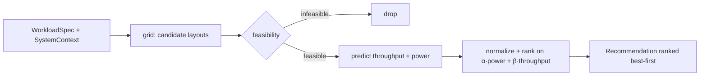

# Coastline

**A context-aware recommender for GPU / datacenter configurations for LLM fine-tuning.**

Given a workload — an LLM, a PEFT method, a GPU model, tokens/sample, batch size — Coastline
grid-searches candidate configurations, filters the infeasible ones, predicts **throughput +
power**, and ranks them on a performance↔energy score. Throughput comes from **Kavier**
(analytical physics) or a data-driven ML model; energy from Kavier-power or the **OpenDC**
simulator; feasibility from IBM **AutoConf** (an OOM-aware validity classifier).

[Get started](getting-started.md){ .md-button .md-button--primary }
[Architecture](architecture.md){ .md-button }

## What it is {#what}

Fine-tuning workloads are complex and largely unpredictable, so users — even experts — routinely
over- or under-provision GPUs, wasting hours or failing jobs outright. Coastline is an
*advisor-on-the-side*: a context-aware, request-compliant recommender that predicts system
behaviour and selects the configuration best fit to your objective. Internal IBM Research
exploration shows early recommenders can cut GPU-hours by **~14%** and under-provisioning
failures by **~80%**.[^thesis]

## The mental model {#model}

-   :material-view-grid-outline: __Grid → Feasibility → Predict → Rank__

    One linear pipeline. Everything routes through `PolicyFactory` and a single
    `GridWorkflowPipeline`. [See the pipeline →](components/pipeline.md)

-   :material-speedometer: __Two predictor families, one interface__

    Analytical **Kavier** physics vs. **data-driven** ML, with a **cache** short-circuit and an
    **OpenDC** energy path — all behind `BasePredictor`. [Predictors →](components/performance.md)

## Explore the components {#components}

- :material-pipe: [__Recommendation pipeline__](components/pipeline.md) — grid → feasibility → predict → rank
- :material-chip: [__Performance predictors__](components/performance.md) — physics · cache · ML · composite
- :material-lightning-bolt: [__Energy predictors__](components/energy.md) — Kavier-power · OpenDC
- :material-shield-check: [__Feasibility__](components/feasibility.md) — AutoConf OOM · divisibility rules
- :material-scale-balance: [__Ranking policies__](components/policies.md) — min-GPU · multi-objective
- :material-database: [__Library & data models__](components/library.md) — GPU/LLM specs · WorkloadSpec

## How it fits together {#architecture}

## Validated against {#validation}

- __~6.2% MdAPE__ — Kavier throughput on a 15% holdout (default `intelligent` path)
- __~2.1% MdAPE__ — best ML predictor (TabPFN); XGBoost 7.2%, CatBoost 8.4%
- __30,000 experiments__ — profiling trace the reference architecture was validated on

Built following FAIR + FOSS principles and integrated with **IBM Ado**.[^thesis]

[^thesis]: R. Nicolae, A. Iosup, A. Trivedi, J. Donkervliet. *A reference architecture and recommender
for LLM fine-tuning workloads* (VU Amsterdam · IBM Research), 2025. The recommender adopts three
engines: **Kavier** (performance), **OpenDC** (sustainability), and **IBM AutoConf** (feasibility).
